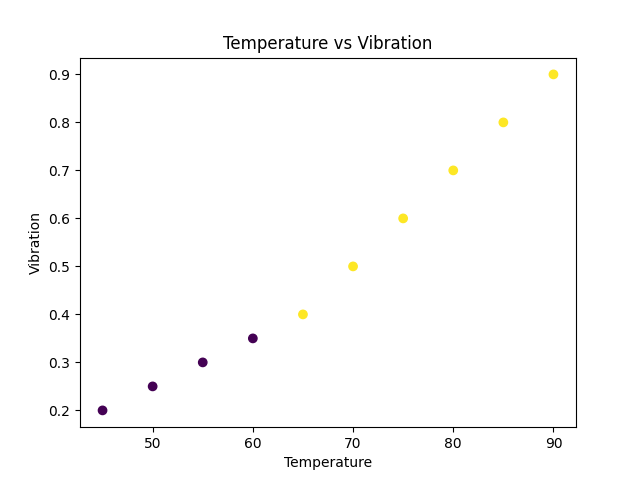

🔧 AI-Powered Predictive Maintenance for IoT Devices

📌 Overview

This project predicts machine failures using simulated IoT sensor data such as temperature, vibration, and pressure.
It uses Machine Learning (Random Forest) to identify potential failures before they occur.

---

🚀 Features

- 📊 Data preprocessing and analysis
- 🤖 Machine Learning model (Random Forest)
- 🔮 Failure prediction system
- 📈 Data visualization (4 graphs)
- 💾 Model saving using joblib
- 📁 Results stored in file
- 🧩 Modular code structure

---

🏗️ Project Structure

AI-Predictive-Maintenance-IoT/
│
├── data/               # Dataset
│   └── iot_dataset.csv
│
├── src/                # Source code
│   └── result.py       # Evaluation module
│
├── models/             # Saved ML models
├── outputs/            # Results
├── images/             # Graphs
├── notebooks/          # Jupyter notebooks
├── docs/               # Documentation
│
├── main.py             # Main execution file
├── requirements.txt    # Dependencies
└── README.md           # Project documentation

---

📊 Visualizations

🔹 Scatter Plot

🔹 Feature Distribution

"Distribution" (images/feature_distribution.png)

🔹 Correlation Heatmap

"Correlation" (images/correlation.png)

🔹 Failure Count

"Failure" (images/failure_count.png)

---

⚙️ Installation

git clone <your-repo-link>
cd AI-Predictive-Maintenance-IoT
pip install -r requirements.txt

---

▶️ Run the Project

python main.py

---

📈 Output

- Predictions printed in terminal

- Results saved in:
  outputs/results.txt

- Model saved in:
  models/model.pkl

---

🧠 How It Works

1. Load IoT dataset
2. Preprocess data
3. Train Random Forest model
4. Predict failures
5. Generate visualizations
6. Save results and model

---

🎯 Future Improvements

- Real-time IoT data integration
- Streamlit dashboard
- Deep learning models
- Cloud deployment

---

👨‍💻 Author

Your Name

---

⭐ If you like this project, give it a star!
